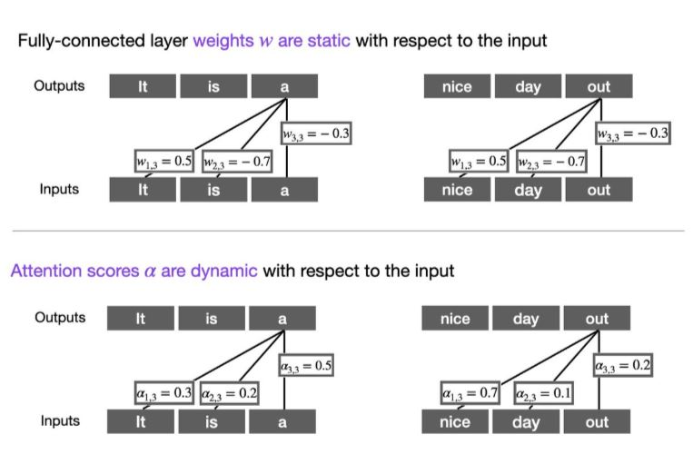
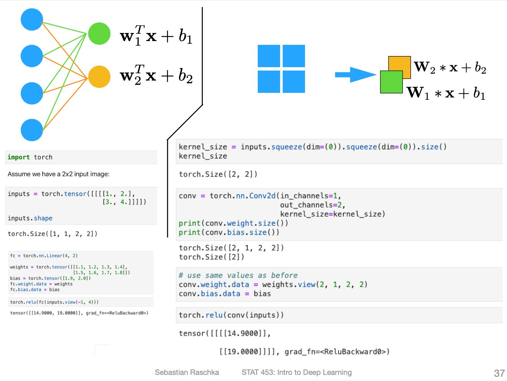

# Attention Mechanisms vs Fully Connected Layers

Conceptually, attention mechanisms allow transformers to attend to different parts of a sequence or image. On the surface, this sounds very similar to a fully connected layer, indeed!

In attention mechanisms, the computation of the attention weights involves the comparison of each input element to each other. The attention weights obtained by this approach are dynamic and input dependent.

In contrast, the weights of a convolutional or fully-connected layer are fixed after training. Attention mechanisms allow a neural networks to selectively weigh the importance of different input features, allowing the model to focus on the most relevant parts of the input for a given task.

This also extends to convolutional layers. E.g., for simplicity, think of cases where fully-connected and convolutional layers are equivalent:

1. making the kernel size similar to the input (left image)
2. stacking 1x1 pixel channels (right image)

