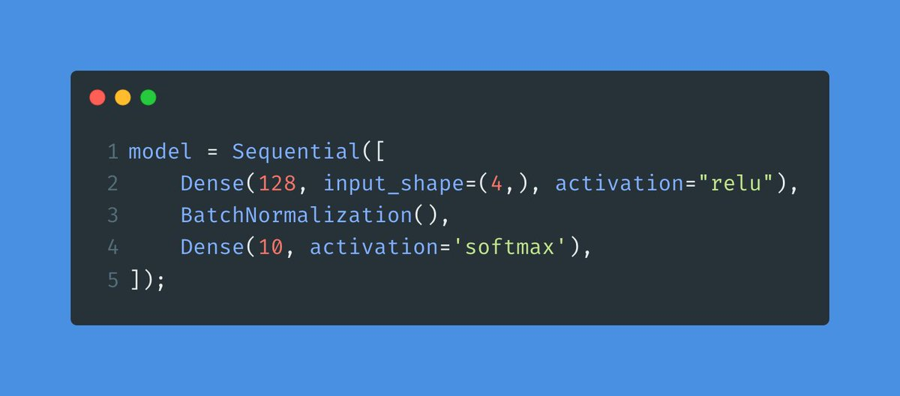
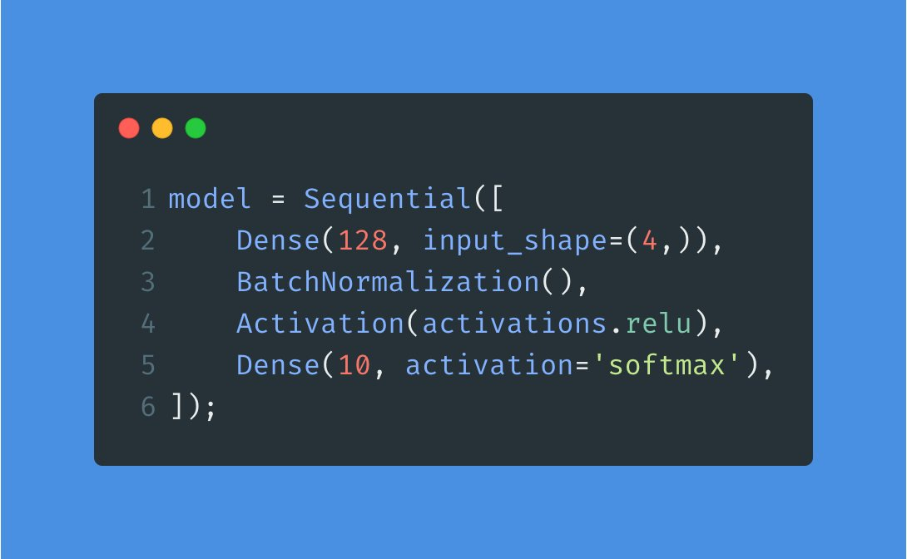
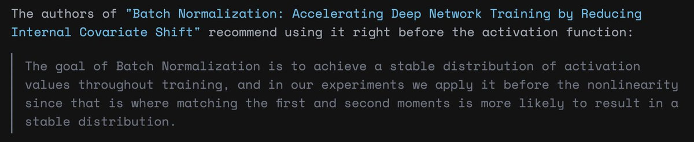
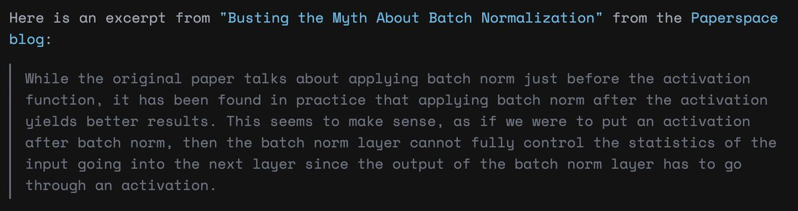

# Batch Normalization

Batch Normalization is a technique used when training deep neural networks.

It normalizes the input to a layer during every training iteration using a mini-batch of data.

It smooths and simplifies the optimization function leading to more stable and faster training.

But there's something different about it: Nobody agrees on how to use it.

Here is an example of Batch Normalization in Keras.
Notice how we use it here before the output layer. In this case, Batch Normalization comes _after_ the activation function (ReLU.)
This is one way, but some people do it differently.

Here is the same example.
Only one difference: Batch Normalization comes before the activation function.

Here is the shocking part:
Depending on what you read, you'll find great arguments to use Batch Normalization before or after the activation function.

Here is a quick summary of both arguments:

If we use Batch Normalization _before_, we can use the full range of the activation function.
For example, Sigmoid will squeeze the output of Batch Normalization between 0 and 1.

If we use Batch Normalization _after_, we will normalize the input to the next layer, so every value will be on the same scale.

So what's the right way? Depends on who you ask. Nobody seems to have a definitive answer.
If you need to use Batch Normalization, I recommend experimenting with it.
